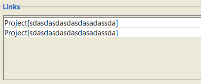
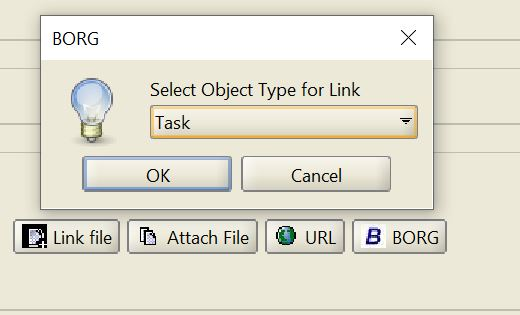

# Assignment 1 - EECS4313
##### Group Members
- Reuben Ninan (216315509)
- Luke Linigari (216307639)
- Eric Kwok (216397150)
- Ahmed Hagi (215043896)

---
- [Assignment 1 - EECS4313](#assignment-1---eecs4313)
        - [Group Members](#group-members)
  - [Task 1](#task-1)
    - [Bug Report 1](#bug-report-1)
      - [Bug Report Title](#bug-report-title)
        - [Reported by:](#reported-by)
        - [Date reported:](#date-reported)
        - [Program (or component) name:](#program-or-component-name)
        - [Configuration(s):](#configurations)
        - [Report type:](#report-type)
        - [Reproducibility:](#reproducibility)
        - [Severity:](#severity)
        - [Problem summary:](#problem-summary)
        - [Problem description:](#problem-description)
        - [New or old bug:](#new-or-old-bug)
    - [Bug Report 2](#bug-report-2)
      - [Bug Report Title:](#bug-report-title-1)
        - [Reported by:](#reported-by-1)
        - [Date reported:](#date-reported-1)
        - [Program (or component) name:](#program-or-component-name-1)
        - [Configuration(s):](#configurations-1)
        - [Report type:](#report-type-1)
        - [Reproducibility:](#reproducibility-1)
        - [Severity:](#severity-1)
        - [Problem summary:](#problem-summary-1)
        - [Problem description:](#problem-description-1)
        - [New or old bug:](#new-or-old-bug-1)
    - [Feature Enhancement](#feature-enhancement)
      - [Feature Title:](#feature-title)
        - [Suggested by :](#suggested-by-)
        - [Date requested:](#date-requested)
        - [Program (or component) name:](#program-or-component-name-2)
        - [Report type:](#report-type-2)
        - [Feature summary:](#feature-summary)
        - [Feature description:](#feature-description)
  - [Task 2](#task-2)
    - [Bug Reports in Mozilla Firefox (3.1)](#bug-reports-in-mozilla-firefox-31)
    - [Issue Reports in HBase (3.2)](#issue-reports-in-hbase-32)
      - [1. There are various kinds of issue reports in HBase (e.g., bugs, enhancements, tasks, etc.). Each issue report can be in different stages (e.g., open, closed, fixed, etc.) Among all these issue reports, which belong to the “bug” type, how many of them are there in total?](#1-there-are-various-kinds-of-issue-reports-in-hbase-eg-bugs-enhancements-tasks-etc-each-issue-report-can-be-in-different-stages-eg-open-closed-fixed-etc-among-all-these-issue-reports-which-belong-to-the-bug-type-how-many-of-them-are-there-in-total)
      - [2. Among the total number of “bugs”, give a quantitative report on their current state. In other words, report the number of bug reports which are in different states (a.k.a., open, closed, or fixed, etc.).](#2-among-the-total-number-of-bugs-give-a-quantitative-report-on-their-current-state-in-other-words-report-the-number-of-bug-reports-which-are-in-different-states-aka-open-closed-or-fixed-etc)
      - [3. Among the “bug type” issue reports, which are either “fixed” or “closed”, what are minimum, average, median, and maximum bug resolution time?](#3-among-the-bug-type-issue-reports-which-are-either-fixed-or-closed-what-are-minimum-average-median-and-maximum-bug-resolution-time)
      - [How I Obtained the Following Results](#how-i-obtained-the-following-results)
        - [Source Code](#source-code)

---

## Task 1

### Bug Report 1

#### Bug Report Title

Find Function (CTRL-F) fails when target text is behind cursor

##### Reported by:

Luke Linigari 

##### Date reported:

09-16-21

##### Program (or component) name:

BORG calendar - Memo tab

##### Configuration(s):

Windows 10
x64-based processor.

##### Report type:

Design Issue.

##### Reproducibility:

Yes, can be reproduced. Changing window size or appearance does not affect reproducibility.

##### Severity:

Minor Issue.

##### Problem summary:

The find function (CTRL-F) in memo tab only searches past the cursor.

##### Problem description:

In the memos tab, if you try and use the find function (CTRL-F) on the text you just wrote, it will only look for instances of that word after the cursor.

How to reproduce:

1. Load the program
2. Navigate to the memos tab
3. Write any string of text, can be a single word or a sentence
4. Ensure your cursor is placed after written text
5. Use the find function (CTRL-F) and search for any char or string you typed
6. You will observe a "not Found - End of search..." popup window apears

- You can change the position of the cursor to where ever in the text, it will still only look ahead of it when looking for matches for the target text. Eg: try "this is so|me text" (cursor in middle of "so|me"), searching for "this" wont work.
- After you get the error message, the cursor moves itself to the beginning of the file from where you last placed it.

##### New or old bug:
New Bug.

### Bug Report 2

#### Bug Report Title: 
Duplicated Project Link
<!-- About 3 to 10 words making clear what your bug report is about. -->
##### Reported by:
Reuben Ninan (216315509)
<!-- The bug reporter’s name and contact information. -->
##### Date reported:
09-17-21
<!-- The date when this bug report is filed. -->
##### Program (or component) name:
BORG Calendar - Project Tab View
<!-- Which program/component has issue? -->
##### Configuration(s):
Windows 10 Home Edition
Java(TM) SE Runtime Environment (build 16.0.2+7-67)
x64-based processor
<!-- The hardware and software configurations under which the bug was found and replicated. -->
##### Report type:
Bug Report
<!-- Is this a bug (e.g., coding error, design issue or documentation mismatch) or feature enhancement? -->
##### Reproducibility:
Yes it is reproducible with any ASCII or Unicode character type labelled projects that are created and linked within the BORG Calendar program.

This bug was tested with a variety of conditions, namely:
- Varying Project name length
- Varying the properties and fields of the project
- Varying the Project description
<!-- Yes / no / sometimes / unknown. For no/sometimes, provide as much information as you can. -->
##### Severity:
Minor Issue
<!-- Is this a major issue or a minor issue? -->
##### Problem summary:
A visual bug occurs when linking a project you created. When linking an existing BORG project, it links the project twice visually.

This bug can bloat the **Links** list and heavily distracts the user.
<!-- A short summary of the problem -->
##### Problem description:
1. Go to the project tab
2. Right click the project file in the "project tree" and add project 
3. Give the project a description and save
4. Click the **`Borg`** button in the links section
5. In the drop down select project click **`Ok`** 
6. Select the project that you just named from the list
7. notice that in the link section there are two instances of the project you just created

**Hypothesis**: I believe this problem is occuring due to a repeated function call in the view controller.


##### New or old bug:
This is a new bug as I have not found an bug report in the past that is related to this.
<!-- Is this a new bug or an existing unfixed bug? -->

### Feature Enhancement

#### Feature Title:

Add an interactable checklist option when making appointments

##### Suggested by :

Luke Linigari & Reuben Ninan

##### Date requested:

9-22-21

##### Program (or component) name:

BORG Calendar-Appointment editor, Day View

##### Report type:

Feature Enhancement

##### Feature summary:

Add an interactable checklist option when creating or editing a new appointment

##### Feature description:

As it stands, there is already an option to make checklists in the BORG calendar app. However, the checklist tab and it's contents is not accessable outside said checklist tab. We suggest that when creating or editing apointments there should be the ability to add checklists to the appointment and have them be displayed in the day and week view.


By clicking on the BORG button, the option to add a link to a checklist should be added. When done, this should trigger the application to visually add each checklist item from the selected checklist to the day and week view. Each checklist item should apear as they do in the checklist tab.

---

## Task 2

### Bug Reports in Mozilla Firefox (3.1)
* The problem summary of the bug report conflicts with the actual behavior shown in the program as shown in the attached screenshot provided by the reporter. In the screenshot the test email sent shows the last address added to email is displayed as each of the other email addresses but the bug report describes it as the first email address added to the email is shown for each of the others. 
* The description of the bug report is missing some details about the configuration of the system in which the bug was found such as the build id for the application and version of Mozilla the reporter used.
* The bug report does not differentiate the behavior between emails with both 'to's and 'cc's recipients and emails with only 'to's recipients. This is important because it will point the programer in the direction of where the problem lies (is it the first email address added regardless whether there are ‘to's and 'cc's recipients or the first email address in the 'to's list or first email address in the 'cc's list?). This could have been added to either the problem steps or the notes sections of the bug report.
* The bug report does not mention whether or not the bug appears in different viewing formats such as opening the email its own window. This could have been mentioned in the notes section.
* Extra notes or comments on the bug should have been added after the description to give further context to the bug such as what could be a possible fix or reasoning as to why this is an interesting bug.

### Issue Reports in HBase (3.2)

#### 1. There are various kinds of issue reports in HBase (e.g., bugs, enhancements, tasks, etc.). Each issue report can be in different stages (e.g., open, closed, fixed, etc.) Among all these issue reports, which belong to the “bug” type, how many of them are there in total?

| Total Issues | 17257 |
|-------------------------|---|

| Issue Type 'Bug' | 8614 |
|-------------------------|---|

#### 2. Among the total number of “bugs”, give a quantitative report on their current state. In other words, report the number of bug reports which are in different states (a.k.a., open, closed, or fixed, etc.).

Out of the total number of issues that are of type : Bug, their current status distribution is displayed below

| Status      | Closed | Open | Patch Available | Resolved | Reopened | In Progress |
|-------------|-------:|-----:|----------------:|---------:|---------:|------------:|
| Occurrences |  5138  |  691 |       136       |   2615   |    27    |      7      |

#### 3. Among the “bug type” issue reports, which are either “fixed” or “closed”, what are minimum, average, median, and maximum bug resolution time?

Among the bug type issue reports the different aggregations for the resolution times are 

| Minimum Resolution Time | 0.00016203703703703703 days |
|-------------------------|---|

| Maximum Resolution Time | 2960.6483680555557 days |
|-------------------------|---|

| Median Resolution Time | 3.9349421296296296 days |
|-------------------------|---|

| Average Resolution Time | 102.98669511443599 days |
|-------------------------|---|

#### How I Obtained the Following Results

This was done using the xml.dom API in order to parse the XML files. For the first part what I did was increment through all the XML files and search for the 'type' tag in each file. I would then format it and see if the type was 'Bug' or not. After doing so I would have the amount of issues that were bugs. For the second part I would keep a dictionary to hold the count for each status in 'Bug' type issues. In the same incrementing of the files from the first part I would just add to the dictionary the value on tag 'status' if it was of type 'Bug' or not. Afterwards I could easily display all the value pairs showing the distribution of statuses in Bug type issues. Finally for the last part I made use of the datetime API in order to format the dates in the XML file. Again in the same incrementing of the files instead of considering all statuses that were of Bug type issue, I would only care about `Resolved` or `Closed` statuses. From there I would get the created time and the resolved time from the `created` and `resolved`' tags. Then I would find the difference in seconds using the two datetime objects to find the exact resolution time in seconds. Finally, I would get the different aggregations of those values and divide by the amount of seconds in a day to represent all the resolution time values in days. I did it in days because thats how JIRA represents their estimate times.

##### Source Code 
```python
import glob
import datetime
from statistics import median
from xml.dom import minidom
from pathlib import Path

month_lookup = {
    'Jan': 1,
    'Feb': 2,
    'Mar': 3,
    'Apr': 4,
    'May': 5,
    'Jun': 6,
    'Jul': 7,
    'Aug': 8,
    'Sep': 9,
    'Oct': 10,
    'Nov': 11,
    'Dec': 12,
}


# Helper Functions for Formatting Purposes
def getText(nodelist):
    rc = []
    for node in nodelist:
        if node.nodeType == node.TEXT_NODE:
            rc.append(node.data)
    return ''.join(rc)


downloads_path = str(Path.home() / "Downloads")
allFiles = downloads_path + '\hbaseBugReport\*.xml'

bugIssues = 0
totalIssues = 0
statusCount = {}
resolveTimes = []

for file in glob.glob(allFiles):
    parsedXML = minidom.parse(file)
    issueType = parsedXML.getElementsByTagName('type')[0]
    issueStatus = parsedXML.getElementsByTagName('status')[0]
    issueCreateTime = parsedXML.getElementsByTagName('created')[0]
    if getText(issueType.childNodes) == "Bug":
        bugIssues += 1
        currStatus = getText(issueStatus.childNodes)
        if currStatus in statusCount:
            statusCount[currStatus] += 1
        else:
            statusCount[currStatus] = 1

        if currStatus == "Resolved" or currStatus == "Closed":
            issueResolveTime = parsedXML.getElementsByTagName('resolved')[0]

            createdTime = getText(issueCreateTime.childNodes).split()
            createdHourlyTime = createdTime[4].split(':')

            resolvedTime = getText(issueResolveTime.childNodes).split()
            resolvedHourlyTime = resolvedTime[4].split(':')

            # datetime(year, month, day, hour, minute, second)
            # Formatted on XML as (Fri, 1 Feb 2008 21:23:06 +0000)
            createTime = datetime.datetime(int(createdTime[3]), int(month_lookup.get(createdTime[2])), int(createdTime[1]),
                                           int(createdHourlyTime[0]), int(createdHourlyTime[1]), int(createdHourlyTime[2]))
            resolveTime = datetime.datetime(int(resolvedTime[3]), int(month_lookup.get(resolvedTime[2])), int(resolvedTime[1]),
                                            int(resolvedHourlyTime[0]), int(resolvedHourlyTime[1]), int(resolvedHourlyTime[2]))

            resolutionTime = resolveTime - createTime
            resolveTimes.append(resolutionTime.total_seconds())

    totalIssues += 1

print("1. Out of " + str(totalIssues) + " total issues, " + str(bugIssues) + " of them are of type : Bug")
print('\n')
print("2. Out of the total number of issues that are of type : Bug, their current status distribution is displayed "
      "below")
for item in statusCount.items():
    print("Bug issues with status " + item[0] + " occurs " + str(item[1]) + " times")
print('\n')
print("3. Among the bug type issue reports the different aggregations for the resolution times are ")
print("Minimum Resolution Time " + str(min(resolveTimes) / 86400) + " days")
print("Maximum Resolution Time " + str(max(resolveTimes) / 86400) + " days")
print("Median Resolution Time " + str(median(resolveTimes) / 86400) + " days")
print("Average Resolution Time " + str((sum(resolveTimes) / len(resolveTimes)) / 86400) + " days")
```
