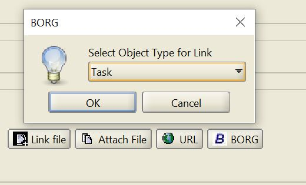

# Feature Enhancement

## Feature Title:

Add an interactable checklist option when making appointments

### Suggested by :

Luke Linigari & Reuben Ninan

### Date requested:

9-22-21

### Program (or component) name:

BORG Calendar-Appointment editor, Day View

### Report type:

Feature Enhancement

### Feature summary:

Add an interactable checklist option when creating or editing a new appointment

### Feature description:

As it stands, there is already an option to make checklists in the BORG calendar app. However, the checklist tab and it's contents is not accessable outside said checklist tab. We suggest that when creating or editing apointments there should be the ability to add checklists to the appointment and have them be displayed in the day and week view.

By clicking on the BORG button, the option to add a link to a checklist should be added. When done, this should trigger the application to visually add each checklist item from the selected checklist to the day and week view. Each checklist item should apear as they do in the checklist tab.
